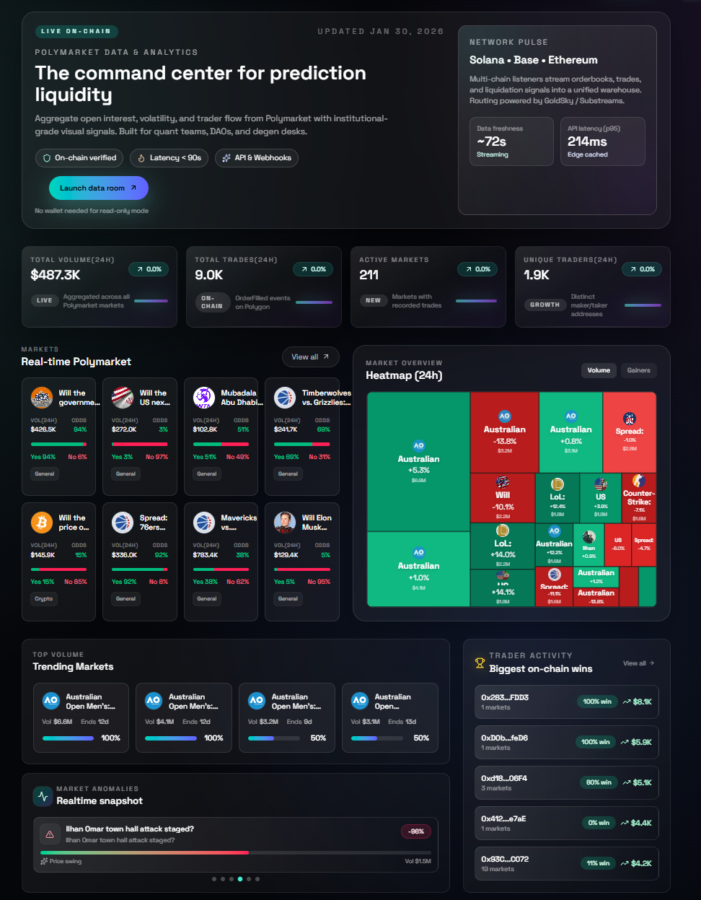
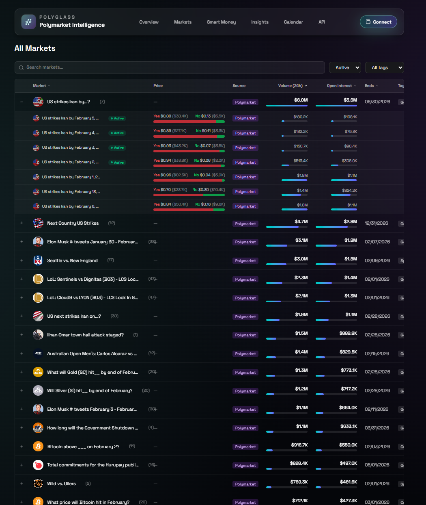
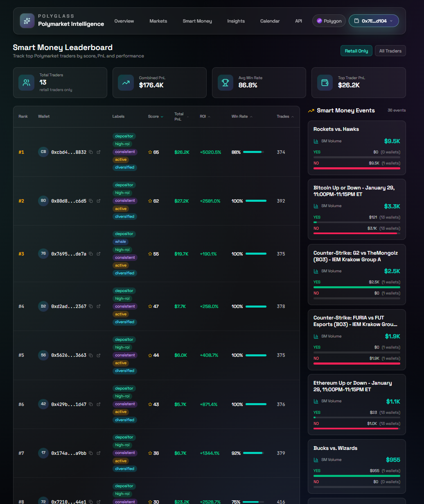
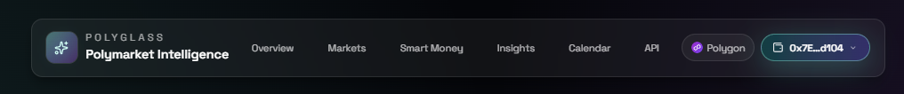
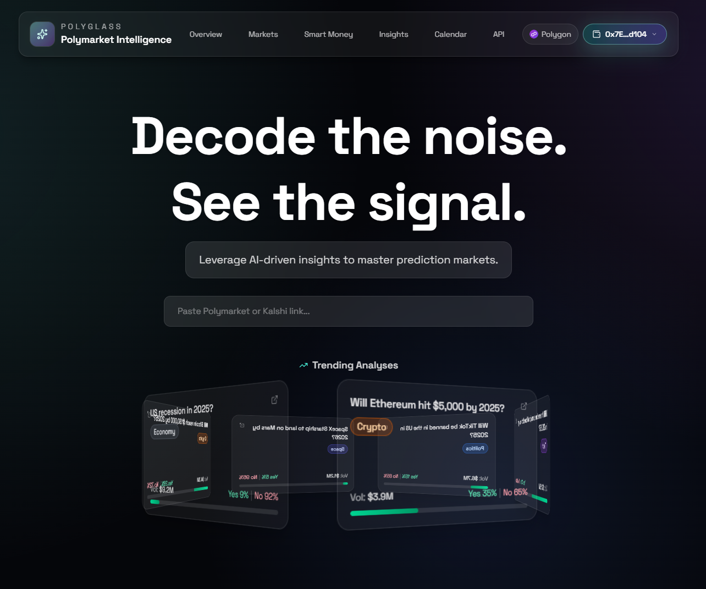
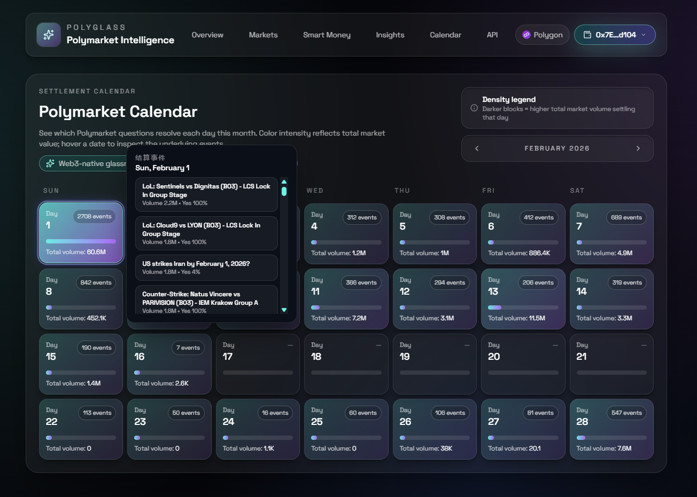

# PolyGlass 演示说明

## 快速启动

```bash
pnpm install
pnpm dev
```

访问 http://localhost:3000

---

## 演示流程

### 1. Overview - 首页仪表盘

**路径**: `/`

展示市场全局概览：

| 组件 | 功能 |
|------|------|
| 统计卡片 | 总市场数、活跃事件、24h 交易量、Smart Money 数量 |
| 市场热力图 | 按分类/交易量可视化市场活跃度，点击进入详情 |
| 市场轮播 | 随机展示 8 个高交易量市场的实时赔率 |
| 异常检测卡片 | 自动识别价格波动 >10%、交易量异动等信号 |
| Smart Money 动态 | Top 5 交易者最新持仓变化 |

**演示要点**：
- 观察热力图的颜色分布，深色代表高交易量
- 点击异常卡片查看具体市场
- 点击 Smart Money 动态跳转交易者详情

---

### 2. Markets - 市场浏览

**路径**: `/markets`

展示 20,000+ 市场数据（自动同步 Polymarket，≤60s 延迟）：

**功能演示**：
1. **搜索** - 输入 "Trump"、"Bitcoin"、"ETF" 等关键词
2. **筛选** - 点击标签：Sports、Crypto、Politics、Science 等
3. **状态切换** - Active（进行中）/ Resolved（已结算）
4. **排序** - 按 Volume、End Date、Open Interest 排序
5. **展开事件** - 点击 "+" 查看事件下的所有子市场
6. **跳转原站** - 点击市场标题跳转 Polymarket

**演示要点**：
- 默认每页 50 条，支持分页
- 展开事件后可以看到 Yes/No 价格和交易量
- 鼠标悬停显示完整标题

---

### 3. 钱包连接

**位置**: 右上角 "Connect" 按钮

**支持钱包**：
- MetaMask（浏览器扩展直连）
- WalletConnect（扫码连接）
- Coinbase Wallet
- 其他注入式钱包

**连接后显示**：
- 链标识：`Polygon`
- 缩略地址：`0x1234...abcd`
- 点击地址可查看详情或断开连接

---

### 4. Smart Money - 链上追踪

**路径**: `/smart-money`

**功能演示**：

| 功能 | 说明 |
|------|------|
| 排行榜 | 按 Score/PnL/ROI/胜率/交易量排名 |
| 视图切换 | All（全部）/ Retail（真实散户：EOA + 有入金记录） |
| 交易者详情 | 点击行展开侧边抽屉，查看持仓、信号、标签 |
| 钱包搜索 | 输入任意地址查询交易统计 |

**评分系统**：
- Score 由 ROI（45%）+ 胜率（35%）+ 交易量（20%）加权计算
- 归一化后显示 0-100 分

**演示要点**：
- 切换 Retail 视图过滤机器人/合约地址
- 点击交易者查看详情抽屉
- 复制地址或跳转 Polygonscan

---

### 5. Smart Money Events

**路径**: `/smart-money/events/[eventId]`

查看 Smart Money 在特定事件上的持仓分布：
- 从 Overview 或 Markets 点击事件进入
- 展示聪明钱在该事件各市场的仓位占比
- 分析 Smart Money 的倾向性

---

### 6. Insights - AI 分析

**路径**: `/insights`

**使用方式**：
1. 复制 Polymarket 事件 URL（如 `https://polymarket.com/event/...`）
2. 粘贴到输入框
3. 点击分析，LLM 自动生成市场洞察报告

**报告内容**：
- 市场概况与历史走势
- 关键影响因素分析
- Smart Money 持仓倾向
- 风险提示

---

### 7. Calendar - 结算日历

**路径**: `/calendar`

**功能**：
- 日历视图展示未来 30 天即将结算的市场
- 颜色深度反映当日市场总价值
- 悬停查看当日结算的具体事件列表
- 点击日期查看详细市场列表

---

## 数据同步

| 模块 | 数据源 | 同步方式 | 说明 |
|------|--------|----------|------|
| Markets | Gamma API | 🟢 自动（≤60s） | 无需操作 |
| Smart Money | Polygon RPC | 🟡 手动 `pnpm fetch` | 扫描链上日志 |
| 回填数据 | Polygon RPC | 🟡 手动脚本 | 历史数据补充 |

---

## 截图

### 主要页面

| Overview | Markets |
|----------|---------|
|  |  |

| Smart Money | wallet search |
|-------------|----------------|
|  |  |

| Insights | Calendar |
|----------|----------|
|  |  |


---

## 技术栈

| 层级 | 技术 |
|------|------|
| 前端框架 | Next.js 16 + React 19 + TypeScript |
| 样式 | Tailwind CSS 4 |
| 可视化 | Recharts + Three.js |
| 钱包 | RainbowKit + wagmi + viem |
| 数据库 | Turso (libSQL) |
| 区块链 | Polygon RPC (Alchemy) |
| 缓存 | React Query + HTTP Cache-Control (60s) |

---

## API 端点

| 端点 | 方法 | 说明 |
|------|------|------|
| `/api/markets` | GET | 市场列表（search/status/tag 筛选） |
| `/api/events` | GET | 事件列表 |
| `/api/events/[id]/markets` | GET | 事件下的子市场 |
| `/api/smart-money` | GET | Smart Money 排行榜（sort/view/limit） |
| `/api/smart-money/[address]` | GET | 单个交易者详情 |
| `/api/stats` | GET | 平台统计数据 |
| `/api/leaderboard` | GET | Top 交易者排行 |
| `/api/traders/[address]` | GET | 交易者 Profile |

---

## 常见问题

**Q: Markets 数据为什么是空的？**
A: 首次加载需要从 Gamma API 拉取数据，可能需要 10-20 秒。

**Q: Smart Money 页面报错？**
A: 需要配置 Turso 数据库并运行 `pnpm fetch` 同步链上数据。

**Q: 钱包连接失败？**
A: 确保安装了 MetaMask 扩展并切换到 Polygon 网络。
